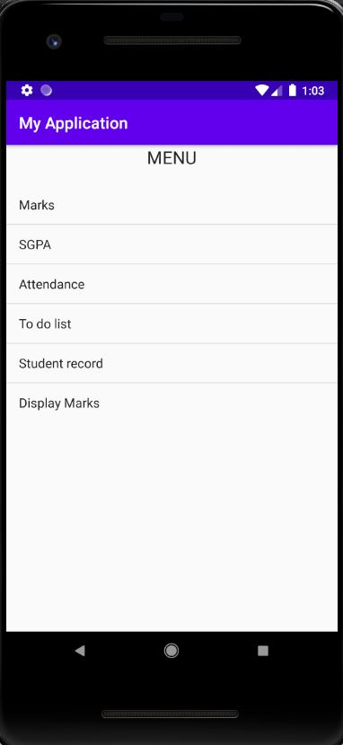

# CGPACalculator
- The TShroff contains the android file. 
- You can run it on Android Studio or on VS Code.
- To run the project, simply clone the github repository to the desired location.
- In android, open a new project pointing to the desired project.
- You can now build it and run th app. The emulator should look as below:

